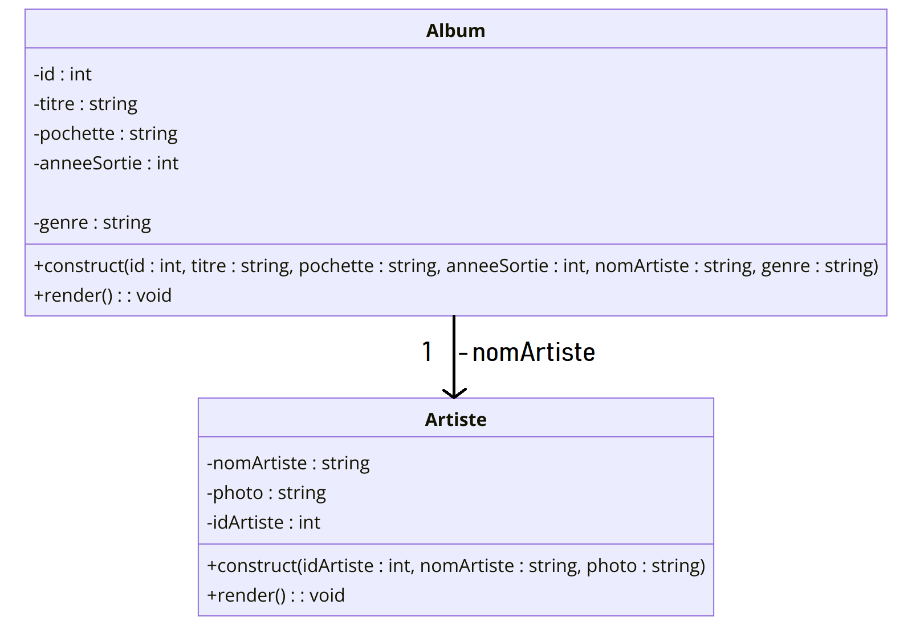
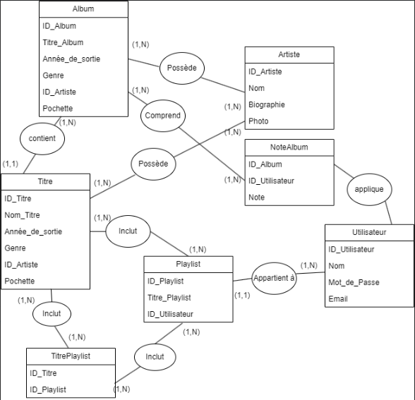
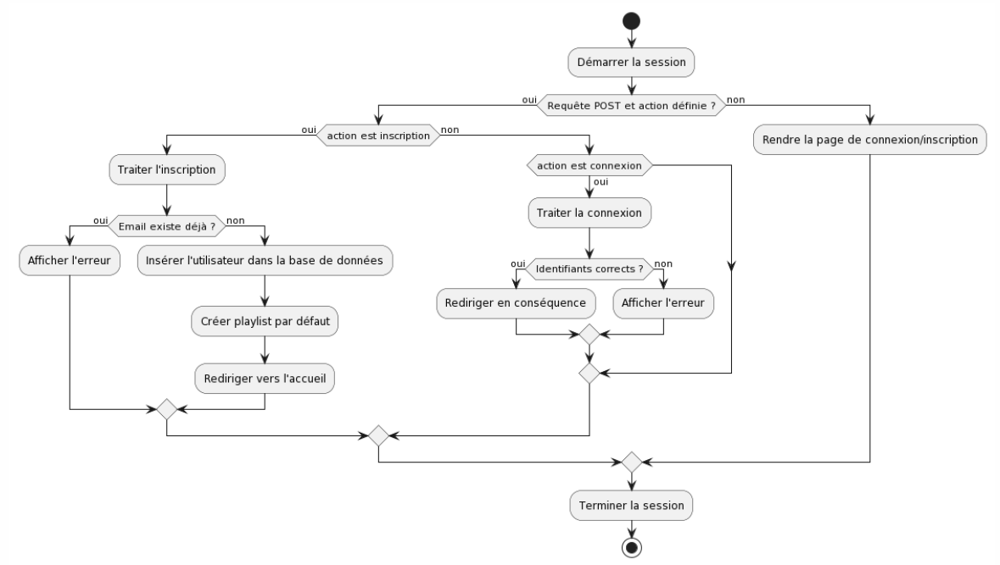
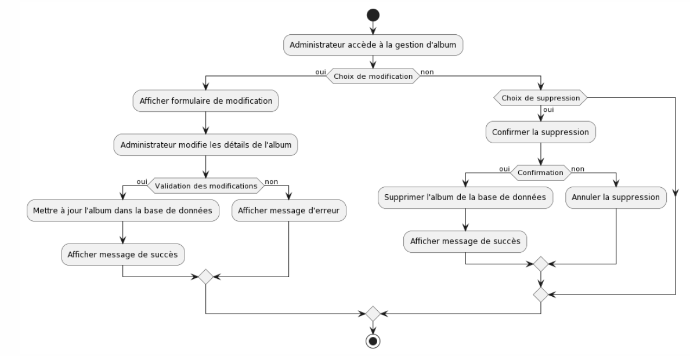
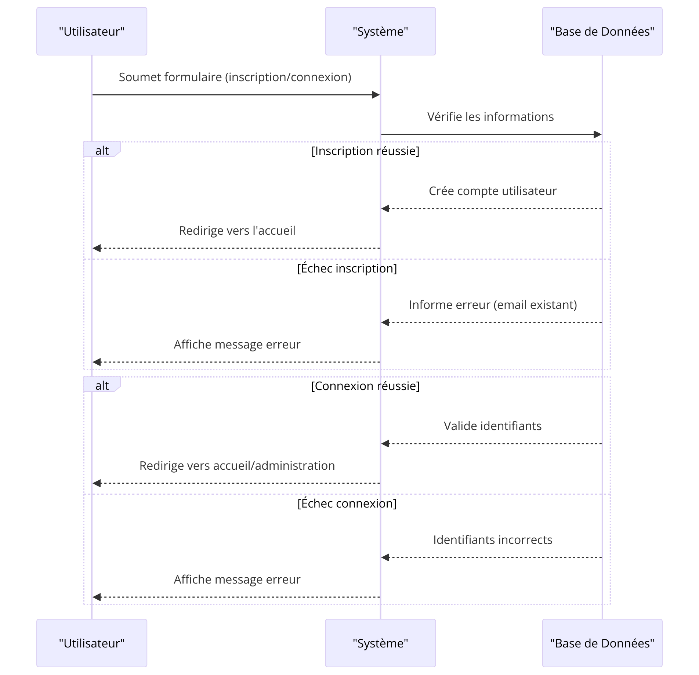
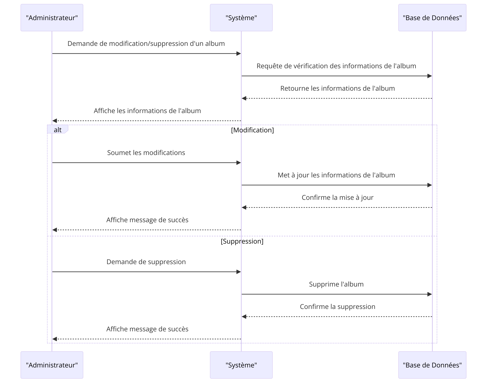

# SPOTMUSIC

Lien GitHub : https://github.com/RemiBly/SAEWebPHP/tree/develop

## Description
Cette application à était réalisé par Juliette ROUSSELET, Rémi BOULAY et Kris TOURE. La demande était qu'à partir des données disponibles dans le fichier album.yml, nous devons développer une application présentant le contenu de cette base de données d'albums de musique.

Le fichier album.yml (l'ancien) contient des informations sur quelques albums et artistes, y compris des pochettes d'albums.

Les fonctionnalités attendues :

- Modèle de la base de données de musique
- Affichage des albums
- Affichage des détails des albums
- Affichage des détails d'un artiste avec ses albums
- Edition d'un album
- Recherche avancée dans les albums (par artiste, année, genre, etc.)


Les fonctionnalités réalisées

- Modèle de la base de données de musique
- Affichage des albums
- Affichage des artistes
- Affichage des détails des albums avec les titres
- Affichage des détails d'un artiste avec ses albums avec les titres phares
- Edition d'un album
- Barre de recherche dans les albums (année, nom de l'artiste, nom d'album)
- Barre de recherche dans les artistes (Nom de l'artiste seulement)
- Edition/Suppression/Update Albums (Module administrateur)
- Login / Users (Avec un rôle User/Admin)
- Playlist par user
- Noter les titres (Cette fonctionnalité est réalisée en likant les titres. On les notes de façon assez binaire j'aime/j'aime pas)

## Installation
Bien évidemment, il faut avoir PHP et SQLITE sur sa machine. Tutos sous les liens suivant : 
* https://www.youtube.com/watch?v=NB9jc8Nu2t4 
* https://www.youtube.com/watch?v=L3FwRRx6bqo&t=176s

Après ces étapes, il faut :
1. Clonez le dépôt.
2. Accédez au répertoire racine du projet.
3. Exécutez la commande suivante pour démarrer le serveur de développement PHP :

```bash
php -S localhost:8080
```

## Réinitialisation de la base de données
Si vous supprimez le fichier sqlite, il est possible de le refaire. Le fichier qui va être refait contiendra les titres, albums et artistes initiaux. Pour le recréer, il suffit de faire (A la racine du projet) : 

```bash
php insertData.php
```

## Fonctionnalités souhaitées
Ce projet, nous avons pris du temps à le réaliser, en oubliant certains projets. Il nous a tellement plus que nous souhaitons le continuer même si il reste un projet universitaire. Nous souhaitons que l'application puisse : 

- Faire des commentaires sur des albums
- Ecouter de la musique
- Avoir des titres tendances
- Etre hégerber

## Ecoute de la musique
L'ecoute de musique n'est pas disponible pour plusieurs raisons. Suite à un manque de temps, nous l'avons pas fait. De plus, il n'était pas demandé que l'application permette de faire écouter de la musique. Et, au vu du nombre de titres dans notre base de données, nous voulions pas avoir environ 80 titres dans notre dépôt. Jusqu'a maintenant, pour écouter les musiques, nous avons juste besoin de mettre les liens vers Youtube pour permettre l'écoute de la musique

## Outils utilisés
Pour la réalisation de ce projet, nous avons utilisé :
- HTML : pour le squelette de l'application
- CSS : pour ajouter du style à l'application
- JavaScript : pour avoir des animations dynamiques et aider l'administrateur pour l'ajout d'un album à un artiste
- PHP : Pour faire la connexion entre le Front et le Back
- SQLITE : pour la base de données
- SYMPHONY : pour lire les fichiers YML

## A SUPPRIMER DANS 1 MOIS
L'application contient un module administrateur. Comme le mot de passe est hashé dans la base de données, il est pas possible de trouver le mot de passe dans le fichier SQLITE (Il est possible de le retrouver dans un autre fichier). Pour se connecter en tant qu'administrateur : 

- Login : admin@spotmusic.com
- Mot de passe : admin1

## Diagramme de classe



## MDC



## Diagrammes activité





## Diagrammes de séquence 





## Rôle dans l'équipe

Rémi BOULAY, développeur Back-End : 
- A commencé à faire le MCD de l'application
- A fait la partie Back-End de l'application

Kris TOURE, développeur Front-End :
- Avec le MCD et le jeu de données, a commencé les pages d'accueil, detail des artistes/albums, playlists. 
- A crée des jeux de données brutes pour permettre aux autres de faire les requetes attendus

Juliette ROUSSELET, développeuse Back-End
- A amélioré le MCD de Rémi
- A fait la gestion de la navigation entre les pages
- A fait les requetes attendus
- A fait l'ajout d'un titre suivant la playlist créé par l'utilisateur